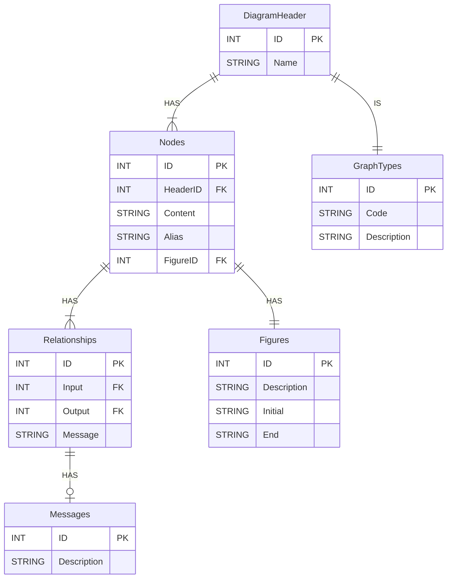

- [Technical Specifications](#technical-specifications)
  - [Graphical interface](#graphical-interface)
  - [🗃️ DATA Administration](#️-data-administration)
    - [Tables](#tables)
      - [GraphTypes](#graphtypes)
        - [Table Definition](#table-definition)
        - [Table Content](#table-content)
      - [Figures](#figures)
        - [Table Definition](#table-definition-1)
        - [Table Content](#table-content-1)
      - [Messages](#messages)
        - [Table Definition](#table-definition-2)
        - [Table Content](#table-content-2)
      - [DiagramHeader](#diagramheader)
      - [Nodes](#nodes)
      - [Relationships](#relationships)
    - [ER Diagram](#er-diagram)

# Technical Specifications

## Graphical interface
**tkinter** (include in Python).

## 🗃️ DATA Administration
**SQLite** local database.

**ORM SQLAlchemy** to interact with the data base.

### Tables

#### GraphTypes
Es una tabla que **NO** podrá modificar el usuario. Será una tabla como la siguiente:

##### Table Definition

|   Column    |                Description                |  Type  |  PK   |  FK   | Admit Null |
| :---------: | :---------------------------------------: | :----: | :---: | :---: | :--------: |
|     ID      |        Primary key of the content         |  INT   |  YES  |  NO   |     NO     |
|    Code     | Necesary command for the mermaid diagram. | STRING |  NO   |  NO   |     NO     |
| Description |      Description of the graph type.       | STRING |  NO   |  NO   |     NO     |

##### Table Content

|  ID   | Code  | Description  |
| :---: | :---: | :----------: |
|   1   |  TD   |  Top - Down  |
|   2   |  LR   | Left - Right |
|   3   |  RL   | Right - Left |
|   4   |  BT   | Botton - Top |

#### Figures

Cannot be modified by the user.

##### Table Definition

|   Column    |                    Description                     |  Type  |  PK   |  FK   | Admit Null |
| :---------: | :------------------------------------------------: | :----: | :---: | :---: | :--------: |
|     ID      |             Primary key of the content             |  INT   |  YES  |  NO   |     NO     |
| Description |             Description of the figure.             | STRING |  NO   |  NO   |     NO     |
|   Initial   | How to initiate the figure in the mermaid diagram. |   STRING   |  NO   |  NO   |     NO     |
|     End     |   How to end the figure in the mermaid diagram.    |   STRING   |  NO   |  NO   |     NO     |

##### Table Content

|  ID   |       Description        | Initial |  End  |
| :---: | :----------------------: | :-----: | :---: |
|   1   |          Circle          |   ((    |  ))   |
|   2   | Rounded Border Rectangle |    (    |   )   |
|   3   |        Rectangle         |    [    |   ]   |
|   4   |         Rhombus          |    {    |   }   |

#### Messages
Can be modified by the user.

##### Table Definition

|   Column    |        Description         |  Type  |  PK   |  FK   | Admit Null |
| :---------: | :------------------------: | :----: | :---: | :---: | :--------: |
|     ID      | Primary key of the content |  INT   |  YES  |  NO   |     NO     |
| Description |  Content of the message.   | STRING |  NO   |  NO   |     NO     |

##### Table Content

|  ID   | Description |
| :---: | :---------: |
|   1   |     YES     |
|   2   |     NO      |
|   3   |     OR      |
|   4   |     AND     |

#### DiagramHeader

| Column |     Description      |  Type  |  PK   |  FK   | Admit Null |
| :----: | :------------------: | :----: | :---: | :---: | :--------: |
|   ID   |          PK          |  INT   |  YES  |  NO   |     NO     |
|  Name  | Name of the diagram. | STRING |  NO   |  NO   |     NO     |

#### Nodes
|  Column  |            Description             |  Type  |  PK   |  FG   | Admit Null |
| :------: | :--------------------------------: | :----: | :---: | :---: | :--------: |
|    ID    |    Primary Key. Autoincrement.     |  INT   |  YES  |  NO   |     NO     |
| HeaderID |       DiagramHeader table ID       |  INT   |  NO   |  YES  |     NO     |
| Content  |        Content of the node.        | STRING |  NO   |  NO   |     NO     |
|  Alias   | Use to create the mermaid diagram. | STRING |  NO   |  NO   |     NO     |
| FigureID |         Id of the figure.          |  INT   |  NO   |  YES  |     NO     |

#### Relationships

| Column  |     Description      |  Type  |  PK   |  FG   | Admit Null |
| :-----: | :------------------: | :----: | :---: | :---: | :--------: |
|   ID    |          PK          |  INT   |  YES  |  NO   |     NO     |
|  Input  | Node ID foreign key. |  INT   |  NO   |  YES  |     NO     |
| Output  | Node ID foreign key. |  INT   |  NO   |  YES  |     NO     |
| Message | Node ID foreign key. | STRING |  NO   |  NO   |    YES     |

### ER Diagram

